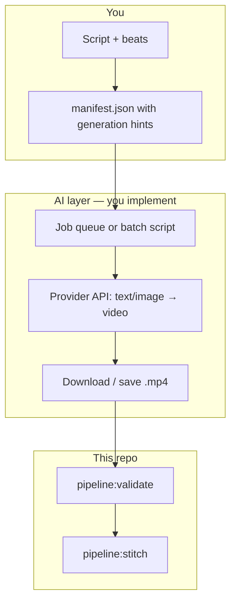

# Integrating AI video generation into the pipeline

This document explains **where** AI generation plugs into the existing flow, **what** to standardize in `manifest.json`, and **how** to implement a batch job (conceptually and technically).

The stitcher only cares that **each `scenes[].file` exists** as a valid video. Everything below is about **producing those files** from AI services or local inference.

## Where it sits in the flow



**Integration boundary:** your code (or CI) reads the manifest, calls an AI provider per scene, writes files to the paths in `scenes[].file`, then you run `pnpm pipeline:validate` and `pnpm pipeline:stitch`.

## Use the `generation` block as your contract

Each scene can carry a `generation` object (ignored by validate/stitch today). **Treat it as the single source of prompts and parameters** for your generator script.

Suggested convention (all optional; extend as needed):

| Field                   | Purpose                                                   |
| ----------------------- | --------------------------------------------------------- |
| `provider`              | Logical name: `runway`, `replicate`, `fal`, `local`, etc. |
| `model`                 | Model id/version your script maps to the provider API     |
| `prompt`                | Full text-to-video prompt                                 |
| `negativePrompt`        | What to avoid                                             |
| `imageRef`              | Path or URL to start/end frame for image-to-video         |
| `targetDurationSeconds` | Desired length (providers often snap to allowed values)   |
| `aspectRatio`           | e.g. `16:9`                                               |
| `seed`                  | Reproducibility                                           |
| `styleRefs`             | URLs or paths to reference images (character/location)    |

Example (illustrative — shape is up to you as long as your script understands it):

```json
"generation": {
  "provider": "replicate",
  "model": "runwayml/gen-4.5",
  "prompt": "Wide shot, Meridian City skyline at dusk, calm before a storm, cinematic animation style",
  "targetDurationSeconds": 10,
  "aspectRatio": "16:9"
}
```

Keep **secrets out of the manifest** if it is committed; use env vars for API keys and put only **non-secret** metadata in JSON.

## Integration patterns

### 1. Manual / tool UI (no code)

Export each clip from Runway, Kling, etc., name files to match `scenes[].file`, then validate + stitch. Zero integration work; slow for long episodes.

### 2. Batch script (recommended first automation)

A Node (or Python) script you run locally or in CI:

1. Load `manifest.json` (path as CLI arg).
2. Resolve each scene’s output path relative to the manifest directory.
3. Skip scenes if the file already exists (idempotent re-runs).
4. For each missing file:
   - Build a request from `generation` + optional defaults (resolution, fps).
   - **Submit** a generation job (many APIs return a job id).
   - **Poll** until status is complete (or use webhooks if the provider supports them).
   - **Download** the resulting URL to the exact `file` path.
5. Exit non-zero on any failure so CI does not stitch bad episodes.

**Async jobs:** Video APIs often take minutes per clip. Your script should tolerate long polls, backoff on rate limits, and log `scene.id` for debugging.

### 3. Orchestrated workers (scale / many episodes)

For large batches, move the same logic into:

- A **queue** (e.g. cloud task queue) with one worker per scene, or
- **GitHub Actions** with matrix jobs (one job per scene) and artifact upload, then a final job that downloads artifacts into the episode folder and runs `pipeline:stitch`.

Same manifest contract; only the **execution environment** changes.

### 4. Image-first then video (continuity)

For more consistent characters/locations:

1. Generate **keyframes** (image models) with shared reference IDs or style prompts.
2. Use **image-to-video** per shot with `generation.imageRef` pointing at those assets.

Your script encodes that two-step flow; the stitcher still sees only final `.mp4` paths.

## Provider options (verify current docs and pricing)

These are typical **programmatic** entry points; names and models change often—always read the vendor’s latest API docs.

| Style             | Examples                                             | Notes                                                                |
| ----------------- | ---------------------------------------------------- | -------------------------------------------------------------------- |
| Direct vendor API | [Runway API](https://docs.dev.runwayml.com/), others | Official SDKs/REST; billing on vendor                                |
| Model marketplace | [Replicate](https://replicate.com/)                  | Many text-to-video models behind one HTTP API; Node client available |
| Other aggregators | fal, Modal, custom Vertex/GCP                        | Often similar: submit → poll → URL                                   |

**Choosing one:** optimize for **(a)** duration limits per request, **(b)** cost per second, **(c)** whether you need **image-to-video**, **(d)** export format (prefer **H.264 + AAC** in `.mp4` for easy concat).

## Technical requirements for smooth stitching

- **Same resolution and fps** across scenes avoids surprises with `ffmpeg -c copy`. If providers differ, generate with a common spec or use `pipeline:stitch -- --reencode`.
- **Audio:** silent clips are fine; add a full mix later in DaVinci Resolve or FFmpeg. If clips have different audio layouts, **reencode** is safer.
- **Idempotency:** do not re-bill a scene if `file` already exists unless you pass `--force`.

## Security and repo hygiene

- Store API keys in **environment variables** or a secrets manager, not in `manifest.json`.
- Add `.env` to `.gitignore` if you introduce local env files (keep a committed `.env.example` with dummy names only).
- Large `.mp4` files: keep under `production/pipeline/media/` or external artifact storage; avoid committing binaries.

## Minimal pseudo-code (batch loop)

```text
manifest = readJson(manifestPath)
baseDir = dirname(manifestPath)
for scene in sortByOrder(manifest.scenes):
  outPath = resolve(baseDir, scene.file)
  if fileExists(outPath): continue
  gen = scene.generation ?? {}
  job = provider.submit(gen)
  url = provider.waitUntilDone(job)
  download(url, outPath)
run("pnpm pipeline:validate -- " + manifestPath)
run("pnpm pipeline:stitch -- " + manifestPath)
```

## Next step in this repository

Implement **`scripts/pipeline/generate-scenes.ts`** (or a small package) that:

1. Parses CLI: `--manifest <path>`, optional `--dry-run`, `--force`.
2. Implements **one** provider adapter (e.g. Replicate HTTP with `REPLICATE_API_TOKEN`).
3. Writes each scene to `scenes[].file` as specified.

Add a `pnpm pipeline:generate` script when that exists. Until then, use this document and the manifest `generation` field to drive an external script or notebook.

## Related files

- [README.md](./README.md) — validate/stitch commands and folder layout
- [schema/episode-manifest.schema.json](./schema/episode-manifest.schema.json) — manifest schema (`generation` is open-ended)
- Example manifest: [examples/s01e01-signal-lost/manifest.json](./examples/s01e01-signal-lost/manifest.json)
