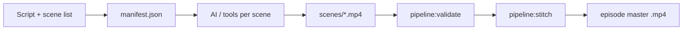

# Episode video pipeline

End-to-end flow:

1. **You** write the **script and storyline** (beats, dialogue, scene breakdown) — your source of truth.
2. **You or an AI tool** exports **one video file per scene** into the episode folder (paths listed in the manifest).
3. **This repo** **validates** the manifest and **stitches** scene files into a single episode video with **FFmpeg**.



## Prerequisites

- **Node** and **pnpm** (see root `README.md`).
- **FFmpeg** on your `PATH` (or set `FFMPEG_PATH` to the binary). Install via [ffmpeg.org](https://ffmpeg.org/download.html), Homebrew (`brew install ffmpeg`), etc.

## Folder layout (per episode)

Recommended pattern: one directory per episode, everything relative to that directory.

```text
production/pipeline/episodes/s01e01-signal-lost/
  manifest.json          # ordered list of scene files + output name
  script.md              # optional; your screenplay / outline
  scenes/
    scene-01.mp4         # AI-generated (or any source)
    scene-02.mp4
  s01e01-master.mp4      # produced by stitch (see output.filename)
```

The example under `examples/s01e01-signal-lost/` mirrors this (add your own `.mp4` files to run stitch).

## Manifest format

- **JSON Schema:** `schema/episode-manifest.schema.json`
- **Fields:**
  - `episode`: season, number, title; optional `targetRuntimeMinutes`, `scriptPath`, `notes`
  - `scenes`: each entry needs `id`, `order`, `file` (path **relative to the manifest file**)
  - `output.filename`: where to write the stitched file (same folder as the manifest unless you use a subpath)
  - Optional `output.reencode`: if `true`, re-encodes with H.264/AAC instead of stream copy (slower, safer when codecs differ)

Optional `generation` on each scene is for **your** notes (prompts, tool ids); the stitcher ignores it.

## Commands

From the repository root:

```bash
# Check JSON shape and list missing scene files (exit 2 if files missing)
pnpm pipeline:validate -- production/pipeline/examples/s01e01-signal-lost/manifest.json

# Concatenate scenes in `order` → one file (requires all scene files present)
pnpm pipeline:stitch -- production/pipeline/examples/s01e01-signal-lost/manifest.json

# Force re-encode (e.g. mixed codecs); overrides manifest output.reencode
pnpm pipeline:stitch -- --reencode production/pipeline/examples/s01e01-signal-lost/manifest.json
```

**Stream copy** (`-c copy`) is fast but requires compatible codecs/resolution between scenes. If concat fails, use `--reencode` or set `"reencode": true` in the manifest.

## AI generation step (your tooling)

This repository does **not** call a specific video API by default. You plug in whichever service or local model you use. **Full integration patterns** (manifest `generation` fields, batch jobs, providers, security): see **[AI_INTEGRATION.md](./AI_INTEGRATION.md)**.

Contract for the stitcher:

- Output **one file per scene** (e.g. `.mp4`).
- Paths match `manifest.json` → `scenes` array → `file`.
- Prefer **consistent** resolution, frame rate, and audio layout across scenes for smooth concat; otherwise rely on **reencode**.

Suggested workflow:

1. Finalize **script** and **scene list** (you can align acts with `Season 1/season.json` and `production/season-1-beats.json`).
2. Copy `examples/s01e01-signal-lost/manifest.json` to your real episode folder and expand `scenes` until runtime targets are met.
3. Run your AI batch (manual or scripted) to fill `scenes/*.mp4`.
4. Run `pnpm pipeline:validate` then `pnpm pipeline:stitch`.

## Quick test clips (no AI)

To verify FFmpeg stitching without real footage:

```bash
cd production/pipeline/examples/s01e01-signal-lost/scenes
ffmpeg -y -f lavfi -i testsrc=duration=2:size=1280x720:rate=30 -pix_fmt yuv420p scene-01.mp4
ffmpeg -y -f lavfi -i testsrc=duration=2:size=1280x720:rate=30 -pix_fmt yuv420p scene-02.mp4
cd ../../../../..
pnpm pipeline:stitch -- production/pipeline/examples/s01e01-signal-lost/manifest.json
```

## Next automation (optional)

You can add a later script that:

- Reads `production/season-1-beats.json` and emits draft `manifest.json` skeletons.
- Calls your chosen video API with `generation` hints from each scene.
- Runs `pipeline:stitch` in CI after assets upload.

Keep API keys and large binaries **out of git**; use env vars and artifact storage for generated media.
